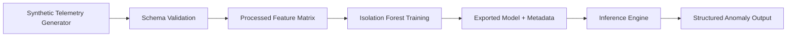
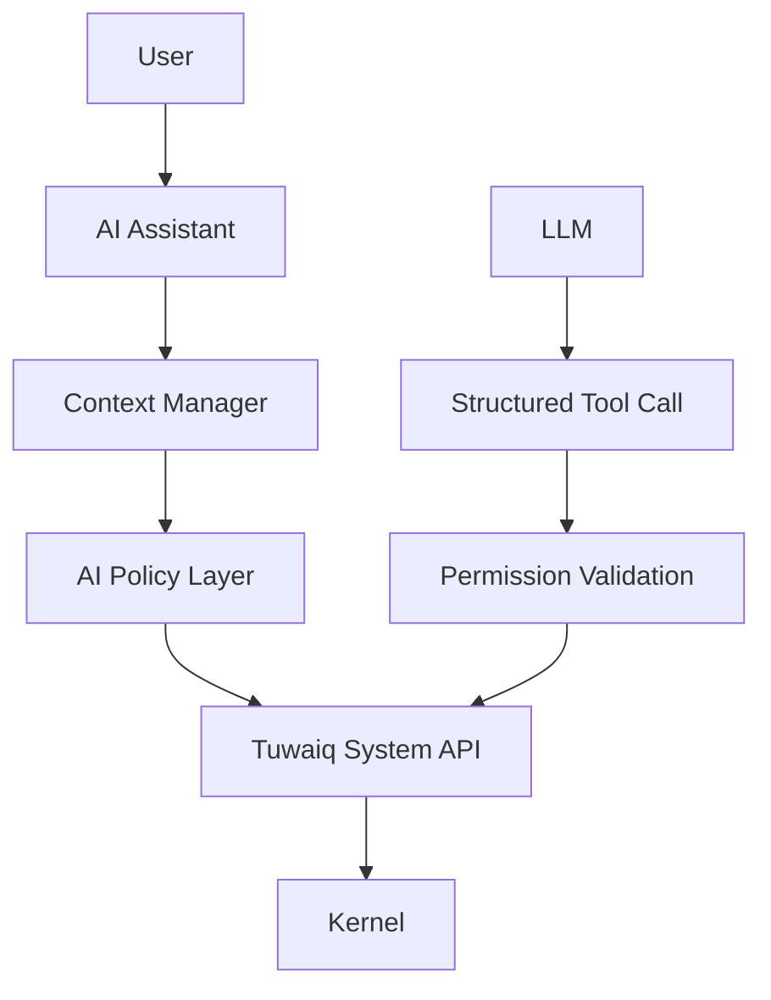

# Architecture

## Scope

This prototype is intentionally isolated under ai_development and is not integrated into TuwaiqOS runtime.

## Components

1. Tuwaiq AI Assistant (future)
- User interaction layer.
- Converts natural language questions into structured intelligence queries.
- Must pass through policy and permission checks.

2. Tuwaiq AI System Intelligence (prototype implemented)
- Telemetry data collection abstraction.
- Schema validation.
- Preprocessing and feature engineering.
- Isolation Forest anomaly detection.
- Structured inference and evaluation.

## Data and Control Flow

## Future Integration Boundary

Security boundary:
- LLM must not directly call kernel internals.
- Policy validation gate is mandatory.

## Agent ModelProvider boundary (Phase 1: Local LLM Foundation)

The Python agent orchestration remains unchanged:

User → Python Agent → `ModelProvider` → Structured Tool Request → Rust Broker → Permission/Policy → OS

- `agent.py` depends only on the abstract `ModelProvider` interface.
- `RuleBasedProvider` remains available for deterministic tests/mocks.
- `LocalModelProvider` now exists as a local-model-ready provider that:
  - holds a selected model profile (`lite`, `default`, `pro`),
  - validates model/runtime configuration safely,
  - delegates execution to a runtime adapter,
  - falls back to `RuleBasedProvider` in Phase 1 while real local inference is deferred.

### Model Profile concept

Model profiles describe configuration without changing agent logic. Each profile
includes:

- model identifier
- model path/location
- runtime configuration
- quantization information
- context configuration
- generation configuration
- hardware/resource requirements

Planned profile mapping for local models:

- `lite` → Qwen3.5-4B quantized
- `default` → Qwen3.5-9B quantized
- `pro` → Qwen3.5-27B

The Agent must not depend directly on Qwen (or any concrete model). Keeping
model details inside provider/profile/runtime layers preserves the Rust broker
security boundary and allows future model replacement without rewriting agent
or broker orchestration.

## Telemetry Availability Statement

Current implementation uses synthetic telemetry only.
Any metric that depends on runtime kernel signals is treated as future integration requirement.

## Detection vs Diagnosis

- Detection: identifies statistically unusual behavior.
- Diagnosis: requires additional causal system instrumentation and is not claimed by this prototype.
