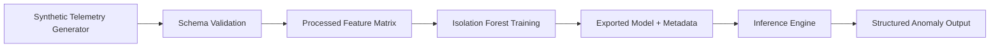
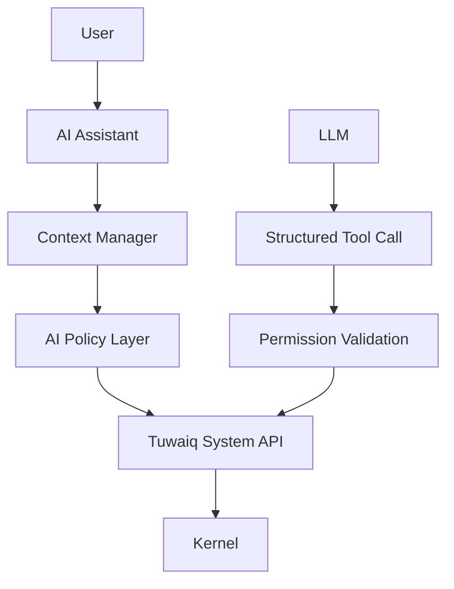

# Architecture

## Scope

This prototype is intentionally isolated under ai_development and is not integrated into TuwaiqOS runtime.

## Components

1. Tuwaiq AI Assistant (future)
- User interaction layer.
- Converts natural language questions into structured intelligence queries.
- Must pass through policy and permission checks.

2. Tuwaiq AI System Intelligence (prototype implemented)
- Telemetry data collection abstraction.
- Schema validation.
- Preprocessing and feature engineering.
- Isolation Forest anomaly detection.
- Structured inference and evaluation.

## Data and Control Flow



## Future Integration Boundary



Security boundary:
- LLM must not directly call kernel internals.
- Policy validation gate is mandatory.

## Agent ModelProvider boundary (Phase 2: Local Qwen Integration)

The Python agent orchestration remains unchanged:

User → Python Agent → `ModelProvider` → Structured Tool Request → Rust Broker → Permission/Policy → OS

- `agent.py` depends only on the abstract `ModelProvider` interface.
- `RuleBasedProvider` remains available for deterministic tests/mocks.
- `LocalModelProvider` now exists as the local Qwen entry point and:
  - holds a selected model profile (`lite`, `default`, `pro`),
  - validates model/runtime configuration safely,
  - delegates model loading/inference/shutdown to `QwenLocalRuntime`,
  - preserves the existing `RuleBasedProvider` fallback for deterministic tests and current tool-routing behavior.

### Runtime selected

Phase 2 uses `llama.cpp` via the Python `llama-cpp-python` binding.

Why this runtime:

- runs fully offline after local installation,
- supports quantized GGUF Qwen models,
- keeps model execution inside the Python local-runtime layer,
- does not require cloud APIs or changes to the Rust broker security boundary.

### Model Profile concept

Model profiles describe configuration without changing agent logic. Each profile
includes:

- model identifier
- model path/location
- runtime configuration
- quantization information
- context configuration
- generation configuration
- hardware/resource requirements

Planned profile mapping for local models:

- `lite` → Qwen3.5-4B quantized (`qwen3.5-4b-quantized.gguf`)
- `default` → Qwen3.5-9B quantized (`qwen3.5-9b-quantized.gguf`) and this is the V1 default
- `pro` → Qwen3.5-27B (`qwen3.5-27b.gguf`)

Model paths are configured centrally:

- built-in relative model file names live in `agent/model_profiles.py`,
- `TUWAIQ_AI_MODEL_ROOT` overrides the local model directory for all profiles,
- `TUWAIQ_AI_MODEL_PATH_LITE`, `TUWAIQ_AI_MODEL_PATH_DEFAULT`, and `TUWAIQ_AI_MODEL_PATH_PRO` can override individual profile paths.

### Local loading flow

`Agent` → `LocalModelProvider` → `QwenLocalRuntime` → `llama.cpp` (`llama-cpp-python`) → local GGUF Qwen model

1. `LocalModelProvider` selects the `lite`, `default`, or `pro` profile.
2. `QwenLocalRuntime` resolves the configured model path.
3. The runtime validates that the profile uses a GGUF file and a compatible `llama.cpp` engine.
4. The runtime lazily loads the model on first inference, records load time, and exposes process RAM/CPU plus inference latency telemetry.
5. Tool execution still goes through the Rust broker only; the model never executes shell commands or bypasses the broker.

### Local smoke test

Run from `AI-Module/` after installing dependencies and placing the default GGUF model on disk:

```bash
export TUWAIQ_AI_MODEL_PATH_DEFAULT=/absolute/path/to/qwen3.5-9b-quantized.gguf
export TUWAIQ_RUN_QWEN_SMOKE=1
python -m pytest agent/tests/test_qwen_smoke.py -q
```

This verifies the simple offline path:

`Hello` → Qwen local runtime → non-empty response

### Limitations and Phase 3 follow-ups

- Current V1 integration is CPU-first by default; GPU offload is only available through explicit profile/runtime configuration.
- VRAM/GPU telemetry is exposed as unavailable when the backend does not provide it directly.
- Timeout handling is defensive at the provider/runtime boundary, but hard cancellation of a native inference already in progress is left for a later phase.
- Full model-driven structured tool calling is intentionally deferred; Phase 2 keeps the existing broker and tool boundaries unchanged.

The Agent must not depend directly on Qwen (or any concrete model). Keeping
model details inside provider/profile/runtime layers preserves the Rust broker
security boundary and allows future model replacement without rewriting agent
or broker orchestration.

## Telemetry Availability Statement

Current implementation uses synthetic telemetry only.
Any metric that depends on runtime kernel signals is treated as future integration requirement.

## Detection vs Diagnosis

- Detection: identifies statistically unusual behavior.
- Diagnosis: requires additional causal system instrumentation and is not claimed by this prototype.
