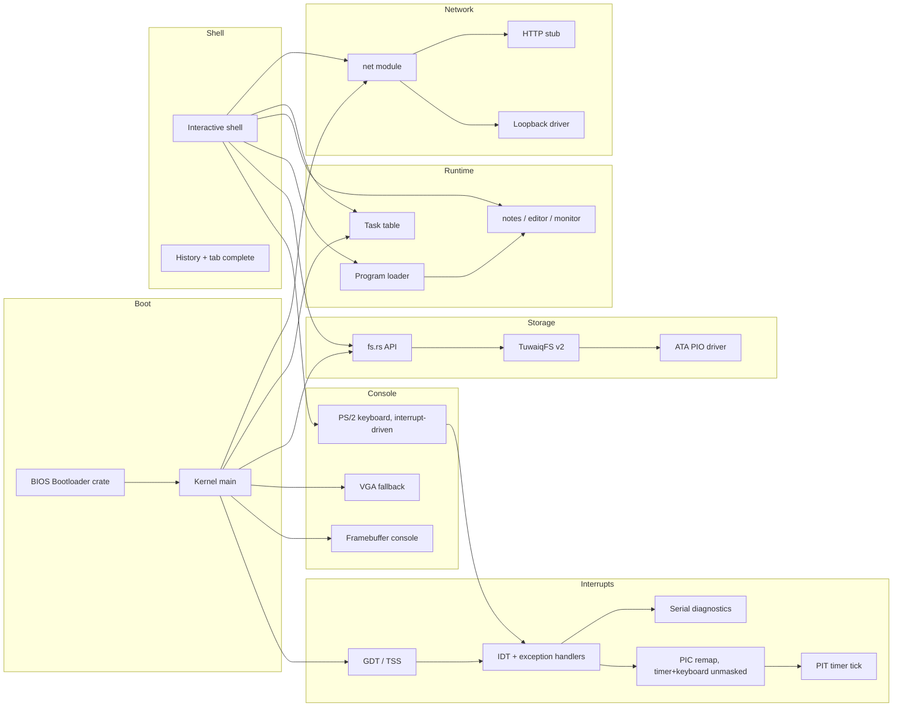

# TuwaiqOS Architecture

## Overview

TuwaiqOS is a monolithic bare-metal kernel written in Rust (`no_std`). All services run in kernel mode today; user-mode separation is planned for v0.7.

## Boot sequence

1. `bootloader` crate loads the kernel ELF from the BIOS disk image.
2. `kernel_main` initializes the heap, then interrupts (GDT/TSS, IDT,
   PIC remap + mask, PIT timer, `sti`), then ATA, TuwaiqFS, tasks, and
   network.
3. Framebuffer or VGA console starts; shell prints boot banner and prompt.

Interrupts must come immediately after the heap: the keyboard event queue
(`keyboard.rs`) allocates, and everything after this point in boot
(`ata::read_sector` polling loops in particular) runs with real hardware
interrupts live rather than a purely polled CPU.

## Kernel modules

| Module | Role |
|--------|------|
| `main.rs` | Entry point, subsystem init order |
| `serial.rs` | COM1 UART -- boot log and panic diagnostics, works headless |
| `gdt.rs` | GDT, TSS, dedicated IST stacks for double-fault and hardware IRQs |
| `interrupts.rs` | IDT, exception handlers, PIC remap/mask, PIT tick, `uptime` |
| `memory.rs` / `allocator.rs` | 1 MiB static heap, `GlobalAlloc` |
| `keyboard.rs` | Interrupt-driven PS/2 Set-1 scancodes, Shift, arrows, Tab |
| `framebuffer_console.rs` | Scaled 8×8 font on bootloader FB |
| `vga_buffer.rs` | 80×25 text mode fallback |
| `shell.rs` | Command loop, history, completion |
| `fs.rs` | In-memory tree API for shell |
| `tuwaiqfs.rs` | On-disk serialization (TuwaiqFS v2) |
| `ata.rs` | Primary master PIO sector I/O |
| `task.rs` | Cooperative task table |
| `loader.rs` / `programs/` | Built-in program registry |
| `apps/` | notes, editor, monitor |
| `net/` | Driver trait, loopback, HTTP stub |
| `ai_bridge.rs` | Offline AI stub for future gateway |
| `reboot.rs` | Sync FS + keyboard controller reset |

## Interrupts (GDT / IDT / PIC / PIT)

- **GDT/TSS** (`gdt.rs`): a minimal GDT (null, kernel code, TSS) plus two
  dedicated Interrupt Stack Table entries -- one for `#DF` (double fault),
  one shared by the timer and keyboard IRQs, so a hardware interrupt never
  depends on whatever stack happened to be active at the interrupt site.
  Loading a new GDT does **not** reload `SS`/`DS`/`ES`/`FS`/`GS` -- the
  bootloader's own (now-stale) selector values are explicitly reloaded to
  null here, which is load-bearing: skipping it produces a GPF on every
  single interrupt return, since `iretq` validates the stacked `SS`
  selector against the *current* GDT.
- **IDT** (`interrupts.rs`): handlers for breakpoint, double fault, page
  fault, general-protection fault, invalid opcode, and divide error, each
  logging full diagnostics over serial (and to the framebuffer console if
  it's confirmed active) before halting. A software breakpoint self-test
  runs immediately after the IDT loads, before any hardware interrupt is
  permitted to fire.
- **PIC remap**: legacy IRQs 0-15 are remapped to vectors 32-47. Only
  IRQ0 (timer) and IRQ1 (keyboard) are left unmasked -- `ChainedPics::initialize()`
  preserves whatever mask the BIOS left rather than resetting it, and
  SeaBIOS leaves several lines (IRQ14, the primary ATA/IDE controller,
  among them) unmasked by default. A hardware IRQ landing on any other,
  not-present vector is exactly what caused a double fault during bring-up.
- **PIT**: channel 0 programmed for a 100 Hz square-wave interrupt, driving
  a tick counter (`interrupts::ticks()` / `uptime_seconds()`) and letting
  the shell's input loop `hlt` between keystrokes instead of busy-spinning.
- **Keyboard**: scancodes now arrive via IRQ1 and are decoded inside the
  ISR into a locked queue; `keyboard::poll_key()` keeps its original
  signature (drain-or-`None`), so `shell.rs` needed no changes beyond
  halting instead of spinning on `None`.

## TuwaiqFS v2

See [docs/TUWAIQFS.md](docs/TUWAIQFS.md). The full directory tree is flattened to path records (`hello.txt`, `docs/readme.txt`) and stored in a metadata region starting at LBA 8465.

## Program loader

`loader.rs` dispatches `run <name>` to built-in programs in `programs/`. The registry pattern is designed so an ELF loader can replace the dispatch table later without changing shell parsing.

## Shell

- Prompt: `tuwaiq@os:~$` at root, `tuwaiq@os:/path$` elsewhere
- History: 16 entries, Up/Down recall
- Tab: completes commands, program names, and file names
- `clear`/`cls`: full screen wipe via framebuffer or VGA

## Memory model

- Stack: kernel stack provided by bootloader, plus two dedicated IST
  stacks (double fault, hardware IRQs) installed via the TSS
- Heap: 4 MiB of real virtual memory at a fixed address (`0x_4444_4444_0000`),
  backed by physical frames mapped in on demand -- not a static array
  anymore (see Paging below). Falls back to an equivalent-size static
  array if the bootloader ever fails to provide a physical memory offset,
  so a paging setup problem degrades the heap rather than failing to boot.
- The bootloader's own page tables do **not** map the legacy VGA text
  buffer (0xB8000) in this project's boot configuration -- writing to it
  from a fault/panic path will page-fault, which is why fault reporting
  only touches the framebuffer console (see `interrupts::report_fault`)

## Paging (Phase 2)

- **Physical memory access**: `main.rs` opts into the bootloader mapping
  *all* physical memory at a dynamic virtual offset
  (`BootloaderConfig.mappings.physical_memory = Some(Mapping::Dynamic)`).
  Without this, `boot_info.physical_memory_offset` is `None` and no
  physical address is dereferenceable at all -- this is exactly why v0.5's
  heap was a static array instead.
- **Frame allocator** (`paging::BootInfoFrameAllocator`): bump-allocates
  4 KiB frames from the bootloader's `Usable` memory regions. Freed frames
  go onto a small pool and are reused before the bump cursor advances --
  a real allocator with working deallocation, not a stub that only ever
  hands out memory.
- **Mapper**: `paging::init` builds an `x86_64::structures::paging::OffsetPageTable`
  over the CPU's active level-4 table (read from `CR3`, translated to a
  virtual address via the physical memory offset above).
  `paging::map_page` wraps `Mapper::map_to` to return a `Result` instead
  of panicking on failure (out of frames, or the page is already mapped).
- **Heap**: `memory::init_heap` maps `HEAP_SIZE` worth of pages at
  `HEAP_START` with `PRESENT | WRITABLE`, then hands that range to the
  same `linked_list_allocator` as before -- `allocator.rs`'s public API
  didn't need to change, only what `init_heap` passes it did.
- **Diagnostics**: `sysinfo` and `monitor` show heap used/free bytes
  (`allocator::used()`/`free()`) and frame allocator stats
  (`paging::frame_stats()`) -- real numbers read from the live allocator
  state, not placeholders.
- **Global state**: the installed mapper and frame allocator live behind
  `spin::Mutex`, not a bare `static mut` -- Phase 3's scheduler is what
  will make them genuinely reachable from more than one execution context,
  and this is deliberately already safe for that before it exists.
- **Still missing** (tracked for later phases): per-process address
  spaces, unmapping/guard pages for anything other than the heap, and
  swapping/paging to disk. This phase gives the kernel real physical
  memory management and a heap that uses it -- it does not yet give
  user-mode processes isolated memory (Phase 4).

## Networking

Loopback driver echoes packets in RAM. `ping localhost` validates the stack. HTTP client returns 503 stubs for future AI Bridge integration.

## Build pipeline

1. `cargo build -p kernel --target x86_64-unknown-none`
2. `cargo build -p tuwaiqos` → `build.rs` wraps kernel in BIOS image
3. Output: `boot-bios-tuwaiqos.img`

## Historical note

Earlier versions used AbdullahOS / AbdullahFS v1 (flat root persistence only). TuwaiqOS v0.5 renamed the project and upgraded to TuwaiqFS v2.
