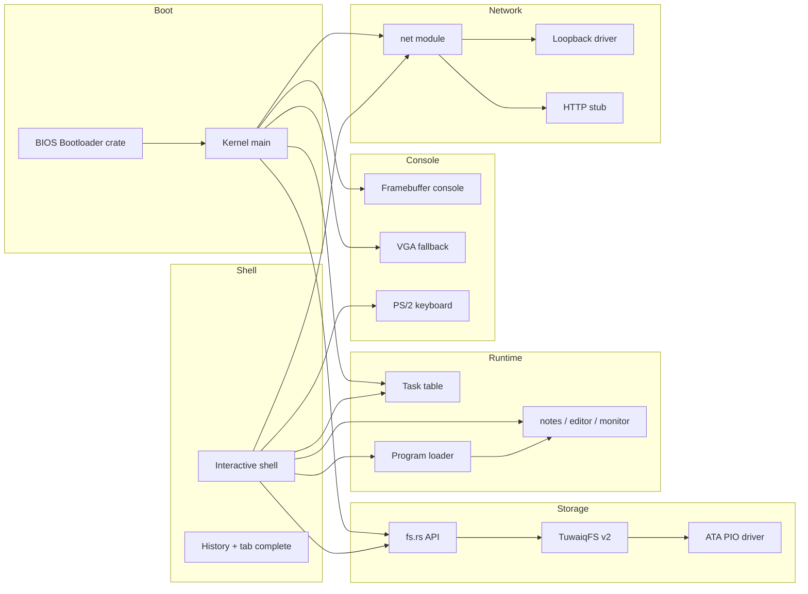

# TuwaiqOS Architecture

## Overview

TuwaiqOS is a monolithic bare-metal kernel written in Rust (`no_std`). All services run in kernel mode today; user-mode separation is planned for v0.7.

## Boot sequence

1. `bootloader` crate loads the kernel ELF from the BIOS disk image.
2. `kernel_main` initializes heap, ATA, TuwaiqFS, tasks, and network.
3. Framebuffer or VGA console starts; shell prints boot banner and prompt.

## Kernel modules

| Module | Role |
|--------|------|
| `main.rs` | Entry point, subsystem init order |
| `memory.rs` / `allocator.rs` | 1 MiB static heap, `GlobalAlloc` |
| `keyboard.rs` | PS/2 Set-1 scancodes, Shift, arrows, Tab |
| `framebuffer_console.rs` | Scaled 8×8 font on bootloader FB |
| `vga_buffer.rs` | 80×25 text mode fallback |
| `shell.rs` | Command loop, history, completion |
| `fs.rs` | In-memory tree API for shell |
| `tuwaiqfs.rs` | On-disk serialization (TuwaiqFS v2) |
| `ata.rs` | Primary master PIO sector I/O |
| `task.rs` | Cooperative task table |
| `loader.rs` / `programs/` | Built-in program registry |
| `apps/` | notes, editor, monitor |
| `net/` | Driver trait, loopback, HTTP stub |
| `ai_bridge.rs` | Offline AI stub for future gateway |
| `reboot.rs` | Sync FS + keyboard controller reset |

## TuwaiqFS v2

See [docs/TUWAIQFS.md](docs/TUWAIQFS.md). The full directory tree is flattened to path records (`hello.txt`, `docs/readme.txt`) and stored in a metadata region starting at LBA 8465.

## Program loader

`loader.rs` dispatches `run <name>` to built-in programs in `programs/`. The registry pattern is designed so an ELF loader can replace the dispatch table later without changing shell parsing.

## Shell

- Prompt: `tuwaiq@os:~$` at root, `tuwaiq@os:/path$` elsewhere
- History: 16 entries, Up/Down recall
- Tab: completes commands, program names, and file names
- `clear`/`cls`: full screen wipe via framebuffer or VGA

## Memory model

- Stack: kernel stack provided by bootloader
- Heap: static 1 MiB buffer in `.bss` — avoids unmapped physical pointer bugs
- No paging yet; identity-style access to low memory

## Networking

Loopback driver echoes packets in RAM. `ping localhost` validates the stack. HTTP client returns 503 stubs for future AI Bridge integration.

## Build pipeline

1. `cargo build -p kernel --target x86_64-unknown-none`
2. `cargo build -p tuwaiqos` → `build.rs` wraps kernel in BIOS image
3. Output: `boot-bios-tuwaiqos.img`

## Historical note

Earlier versions used AbdullahOS / AbdullahFS v1 (flat root persistence only). TuwaiqOS v0.5 renamed the project and upgraded to TuwaiqFS v2.
